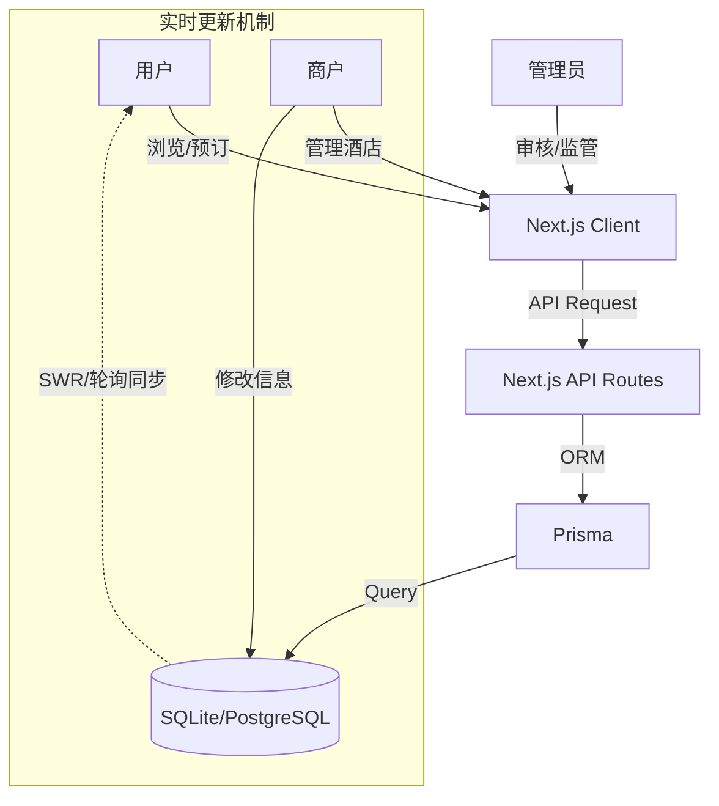
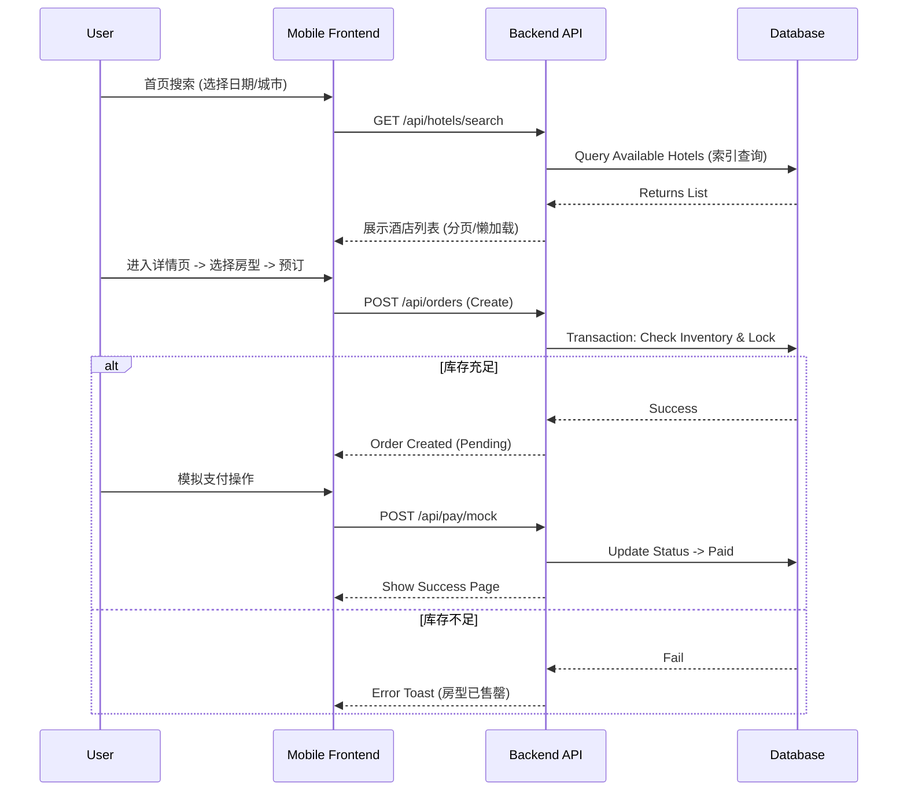
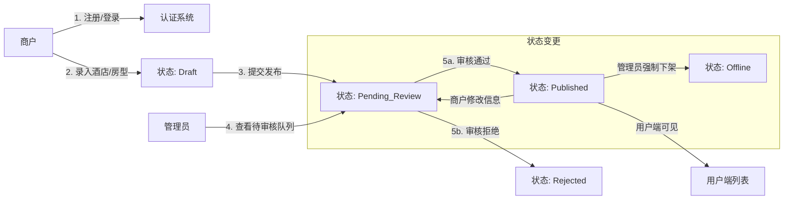

# 项目开发计划：易宿酒店预订平台

**生成日期**: 2026-02-01  
**项目周期**: 2026-02-01 至 2026-02-25  
**团队规模**: 3人 (后端 A, 后端 B, 前端 C)

---

## 0. 项目全景与需求总览 (Project Overview)

### 0.1 核心需求摘要

本项目旨在构建一个**移动端用户预订**与**PC端商户管理**相结合的酒店平台。

| 角色              | 核心功能                                                                 | 关键技术点                       |
| :---------------- | :----------------------------------------------------------------------- | :------------------------------- |
| **用户 (Mobile)** | 首页搜索(日期/地点)、无限滚动列表、详情页(轮播/房型)、下单预订、订单管理 | 日历组件、虚拟滚动、实时库存检查 |
| **商户 (PC)**     | 注册/登录、酒店信息录入(多图上传)、房型管理、订单查看                    | 复杂表单、图片上传、实时数据同步 |
| **管理员 (PC)**   | 审核酒店(通过/拒绝)、酒店下架管理                                        | 状态机流转、权限控制 (RBAC)      |

### 0.2 系统交互流程图 (Flowcharts)

#### **A. 总体架构与数据流**

#### **B. 用户预订核心流程**

#### **C. 商户上架与审核流程**

---

## 1. 前期共识与基础准备 (Kick-off)

在正式写代码之前，全员必须对以下事项达成一致，以减少后期返工：

### 1.1 开发规范共识

- [ ] **代码风格**: 统一使用 ESLint + Prettier，启用 `save-exact` 依赖版本锁定。
- [ ] **API 规范**:
  - 统一 Response 结构: `{ code: 200, data: any, message: string }`。
  - 错误处理: 统一 HTTP 状态码与错误信息映射表。
- [ ] **协作模式**:
  - 每日早会同步进度 (15min)。
  - 遇到 API 变更必须先通知前端/后端。

### 1.2 技术栈确认 (Next.js 全栈方案)

- **前端**: React (Next.js 14 App Router), Tailwind CSS, Shadcn/UI, React Query, `react-date-range`, `react-map-gl`。
- **后端**: Node.js (Next.js API Routes / Server Actions), Prisma ORM, NextAuth.js。
- **数据库**: SQLite (开发阶段) -> PostgreSQL (生产/部署阶段)。
- **其他**: TypeScript (全量), Zod (验证)。

---

## 2. 团队角色分工

### 🧑‍💻 **成员 A (Backend Lead / Infra)**

- **定位**: 架构搭建、核心鉴权、订单支付、DevOps。
- **职责**:
  - 搭建项目骨架与数据库 Schema。
  - 实现复杂的鉴权逻辑 (NextAuth)。
  - 负责订单生命周期管理与库存并发控制。
  - 编写核心工具类与通用中间件。

### 🧑‍💻 **成员 B (Backend / Business)**

- **定位**: 业务功能实现、复杂查询、管理端逻辑。
- **职责**:
  - 酒店/房型数据的 CRUD 实现。
  - 复杂的搜索筛选逻辑 (按日期、星级、价格、位置)。
  - 审核流程状态机实现。
  - 数据校验与清洗 (Zod)。

### 🎨 **成员 C (Frontend / Design)**

- **定位**: 移动端用户体验、PC管理端交互、组件封装。
- **职责**:
  - 移动端 H5 界面开发 (首页、列表、详情、个人中心)。
  - PC 端商户/管理员后台界面开发。
  - 核心交互实现 (虚拟滚动、日历选择、地图交互)。
  - 全局 UI 组件库维护。

---

## 3. 详细每日任务计划 (Feb 1 - Feb 25)

### 📅 第一阶段：基础搭建与数据录入 (Feb 1 - Feb 7)

#### **Feb 1: 项目初始化**

- **全员**:
  - [ ] 召开启动会，确认上述“前期共识”。
  - [ ] 拉取 Git 仓库，配置本地开发环境 (Node.js, VSCode 插件)。
- **成员 A**:
  - [ ] 初始化 Next.js 项目，配置 TS, Tailwind, ESLint。
  - [ ] 设计 Prisma Schema 初稿 (User, Hotel, Room, Order) 并建立关联。
- **成员 C**:
  - [ ] 设计全局 Layout (移动端 BottomNav, PC 端 Sidebar)。
  - [ ] 配置 UI 组件库 (Shadcn/UI)，自定义 Theme 颜色。

#### **Feb 2: 认证系统与数据库迁移**

- **成员 A**:
  - [ ] 执行 `prisma migrate` 创建数据库表。
  - [ ] 配置 NextAuth.js，实现 Credentials Provider 登录逻辑。
- **成员 B**:
  - [ ] 编写并运行 Seed 脚本，生成初始的 Admin 账号与测试商户账号。
- **成员 C**:
  - [ ] 开发 **[移动端/PC]** 通用的登录/注册页面 UI。
  - [ ] 对接登录 API，实现 JWT Token 存储与路由守卫 (Middleware)。

#### **Feb 3: 酒店管理 (后端)**

- **成员 B**:
  - [ ] 实现 `POST /api/hotels` (创建酒店) 接口，包含 Zod 验证。
  - [ ] 实现 `GET /api/hotels/merchant` (商户获取自己酒店) 接口。
- **成员 A**:
  - [ ] 封装统一的图片上传接口 (支持本地存储或简单的 Base64 处理作为 MVP)。
- **成员 C**:
  - [ ] 开发 **[PC端]** 酒店录入表单 UI (第一部分: 基础信息)。

#### **Feb 4: 酒店管理 (前端对接)**

- **成员 C**:
  - [ ] 完善 **[PC端]** 酒店录入表单 UI (第二部分: 图片上传与设施选择)。
  - [ ] 对接酒店创建接口，实现表单提交与错误提示。
- **成员 B**:
  - [ ] 实现 `PUT /api/hotels/:id` 更新接口。
  - [ ] 实现 `DELETE /api/hotels/:id` (软删除) 接口。

#### **Feb 5: 房型管理**

- **成员 B**:
  - [ ] 实现 房型 (RoomType) 的 CRUD 接口，确保与 Hotel ID 关联。
- **成员 C**:
  - [ ] 开发 **[PC端]** 房型管理列表页 (在酒店详情页中管理房型)。
  - [ ] 实现房型添加/编辑模态框。

#### **Feb 6: 管理员审核**

- **成员 B**:
  - [ ] 实现管理员获取“待审核”酒店列表 API。
  - [ ] 实现审核动作 API (Approve/Reject)，更新 `status` 字段。
- **成员 C**:
  - [ ] 开发 **[PC端]** 管理员审核看板 UI。
  - [ ] 实现审核操作的前端交互。

#### **Feb 7: 阶段里程碑 (Milestone 1)**

- **全员**:
  - [ ] **联调测试**: 确保商户能注册、登录、录入酒店，管理员能审核通过。
  - [ ] **数据填充**: 成员 A/B 配合生成 20+ 条高质量的测试酒店数据 (用于下周列表页开发)。

---

### 📅 第二阶段：C端核心流程 (Feb 8 - Feb 14)

#### **Feb 8: 移动端首页**

- **成员 C**:
  - [ ] 开发 **[移动端]** 首页 UI (Banner, 快捷入口)。
  - [ ] 集成 `react-date-range` 开发日期选择器组件。
- **成员 B**:
  - [ ] 实现首页推荐/热门酒店 API。

#### **Feb 9: 搜索与筛选 (后端)**

- **成员 B**:
  - [ ] 实现核心搜索 API: 支持 `city`, `dateRange` (检查库存), `starRating` 等参数。
  - [ ] 优化 Prisma 查询性能 (添加索引)。
- **成员 A**:
  - [ ] 协助解决日期重叠查询的逻辑难题 (Available Rooms Logic)。

#### **Feb 10: 酒店列表页 (前端)**

- **成员 C**:
  - [ ] 开发 **[移动端]** 酒店列表页 UI。
  - [ ] **核心任务**: 实现虚拟滚动 (Virtual Scroll) 或触底加载 (Intersection Observer) 以优化长列表性能。

#### **Feb 11: 列表页筛选与排序**

- **成员 C**:
  - [ ] 实现列表页顶部的筛选面板 (价格范围、星级)。
  - [ ] 对接搜索 API，实现参数联动查询。
- **成员 B**:
  - [ ] 补充排序功能 API (价格低到高/高到低)。

#### **Feb 12: 酒店详情页**

- **成员 C**:
  - [ ] 开发 **[移动端]** 酒店详情页 (轮播图, 设施展示, 地图组件)。
  - [ ] 展示房型列表。
- **成员 A**:
  - [ ] 提供获取单体酒店详情 API (包含已审核通过的房型)。

#### **Feb 13: 预订流程 (下单)**

- **成员 A**:
  - [ ] 实现 `POST /api/orders` 接口:
    - 校验库存 (Transaction)。
    - 创建 Pending 状态订单。
    - 扣减库存 (或锁定库存)。
- **成员 C**:
  - [ ] 开发 **[移动端]** 订单确认页 (填写入住人信息)。
  - [ ] 对接下单接口。

#### **Feb 14: 阶段里程碑 (Milestone 2)**

- **全员**:
  - [ ] **流程跑通**: 用户可以从首页搜索 -> 列表 -> 详情 -> 下单。
  - [ ] 检查移动端长列表滑动是否流畅。

---

### 📅 第三阶段：高级功能与优化 (Feb 15 - Feb 21)

#### **Feb 15: 支付与状态流转**

- **成员 A**:
  - [ ] 实现模拟支付接口 (Mock Pay): 接收 OrderID，随机返回成功/失败，更新订单状态。
- **成员 C**:
  - [ ] 开发支付结果页 (Success/Fail)。
  - [ ] 在订单确认后跳转支付页，支付成功后跳转订单详情。

#### **Feb 16: 个人中心与订单管理**

- **成员 B**:
  - [ ] 实现 `GET /api/orders/user` (我的订单) 接口。
  - [ ] 实现 `PUT /api/orders/:id/cancel` (取消订单) 接口，需回滚库存。
- **成员 C**:
  - [ ] 开发 **[移动端]** 个人中心页 & 我的订单列表 (Tab切换: 全部/待支付/已完成)。

#### **Feb 17: 实时性更新 (Real-time)**

- **成员 A/B**:
  - [ ] 方案实现: 使用 SWR / React Query 的 Polling (轮询) 机制，每 5-10s 检查一次订单状态或库存变化 (MVP方案)。
- **成员 C**:
  - [ ] 在商户端修改价格后，验证移动端是否能在下次刷新时自动更新。

#### **Feb 18: 商户端订单管理**

- **成员 B**:
  - [ ] 实现商户查看自家酒店订单的 API。
- **成员 C**:
  - [ ] 开发 **[PC端]** 商户订单管理表格。

#### **Feb 19: 性能优化**

- **成员 C**:
  - [ ] 图片懒加载优化 (使用 `next/image`)。
  - [ ] 减少不必要的 Re-render。
- **成员 A/B**:
  - [ ] API 响应速度检查，优化慢查询。

#### **Feb 20: 异常处理与反馈**

- **全员**:
  - [ ] 全局搜索代码中的 `TODO`，补充缺失的错误处理 (Try-Catch)。
  - [ ] 为所有表单添加前端验证 (React Hook Form + Zod)。
  - [ ] 添加 Toast 提示 (成功/失败反馈)。

#### **Feb 21: 阶段里程碑 (Milestone 3)**

- **全员**:
  - [ ] 功能封板 (Feature Freeze)。不再新增功能，只修 Bug。

---

### 📅 第四阶段：收尾与交付 (Feb 22 - Feb 25)

#### **Feb 22: 交叉测试 (Bug Bash)**

- **全员**:
  - [ ] **A 测试 C 的工作**: 重点测移动端兼容性、UI 细节。
  - [ ] **B 测试 A 的工作**: 重点测支付流程、库存并发准确性。
  - [ ] **C 测试 B 的工作**: 重点测搜索筛选准确性、数据录入逻辑。
  - [ ] 记录 Bug 列表并分配修复。

#### **Feb 23: Bug 修复**

- **全员**:
  - [ ] 集中修复昨日发现的高优先级 Bug。

#### **Feb 24: 文档与清理**

- **成员 A**:
  - [ ] 编写详细的 `README.md`: 包含技术栈介绍、启动步骤、环境变量说明。
- **成员 B**:
  - [ ] 导出最终的数据库 SQL 或 Seed 文件，确保评审老师能一键运行。
- **成员 C**:
  - [ ] 截取项目关键页面截图 (Gif/PNG)，放入文档目录。
  - [ ] 录制简单的操作演示视频 (可选)。

#### **Feb 25: 最终提交**

- **全员**:
  - [ ] 代码 Review，清理无用注释与 `console.log`。
  - [ ] 确认 Git 仓库干净，主分支最新。
  - [ ] **提交作业**。

---

## 4. 关键风险与应对 (Risk Management)

| 风险点             | 可能性 | 影响 | 应对策略                                                       |
| :----------------- | :----- | :--- | :------------------------------------------------------------- |
| **长列表卡顿**     | 高     | 严重 | 移动端列表页务必使用虚拟滚动技术；图片必须压缩并懒加载。       |
| **日期库存重叠**   | 中     | 严重 | 后端需编写专门的单元测试来覆盖预订日期交叉的场景。             |
| **前后端进度脱节** | 中     | 中等 | 后端优先提供 Mock 数据或接口定义 (Type定义)，前端先行开发 UI。 |
| **需求蔓延**       | 低     | 中等 | 严格遵守计划，Feb 21 后不再接受新需求变更。                    |
